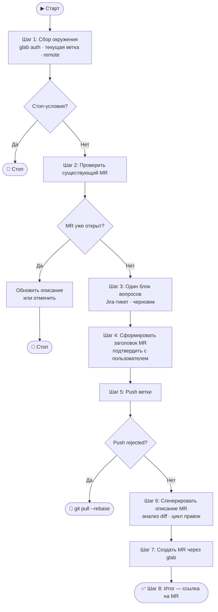

# Create Merge Request

## Оглавление

1. [Шаг 1 — Сбор окружения](#шаг-1--сбор-окружения)
2. [Шаг 2 — Проверь существующий MR](#шаг-2--проверь-существующий-mr)
3. [Шаг 3 — Один блок вопросов](#шаг-3--один-блок-вопросов)
4. [Шаг 4 — Заголовок MR](#шаг-4--заголовок-mr)
5. [Шаг 5 — Push ветки](#шаг-5--push-ветки)
6. [Шаг 6 — Описание MR](#шаг-6--описание-mr)
7. [Шаг 7 — Создай MR](#шаг-7--создай-mr)
8. [Шаг 8 — Итог](#шаг-8--итог)

---

## Схема логики



---

## Шаг 1 — Сбор окружения

Выполни все команды молча, без вывода пользователю. При ошибке — останови с сообщением.

```bash
glab auth status                                    # ❌ если ошибка: glab auth login
git branch --show-current                           # current_branch
git remote get-url origin                           # → host, namespace/repo
git show-ref --verify --quiet refs/remotes/origin/main && echo main \
  || git show-ref --verify --quiet refs/remotes/origin/master && echo master
                                                    # target_branch (спроси вручную если не найдено)
```

**Стоп-условия:**
- не в git-репозитории
- `glab` не аутентифицирован
- `current_branch` совпадает с `target_branch`

Если рабочая директория грязная (`git status --porcelain` не пуст) — предупреди:
> ⚠️ Есть незакоммиченные изменения. Они не попадут в MR. Продолжить? [y/N]

---

## Шаг 2 — Проверь существующий MR

```bash
glab mr list --source-branch <current_branch> --repo <host>/<namespace>/<repo>
```

Если MR **уже существует** — предложи:
> ⚠️ MR !<id> «<title>» уже открыт. Обновить описание или отменить?

- **Обновить** → собери diff (Шаг 6), сгенерируй описание (Шаг 6), опубликуй:
  ```bash
  glab mr update <id> --repo <host>/<namespace>/<repo> --description "$(cat /tmp/mr_desc.md)"
  ```
  Сообщи: `✅ Описание обновлено в MR !<id>` → стоп.
- **Отменить** → стоп.

---

## Шаг 3 — Один блок вопросов

Собери данные для автозаполнения:

```bash
# Ищем Jira-тикет в имени ветки
git branch --show-current | grep -oE '[A-Z]+-[0-9]+'

# Коммиты — для генерации заголовка в Шаге 4
git log origin/<target_branch>..HEAD --oneline --no-merges
```

Если Jira-тикет **найден автоматически** — используй его, не спрашивай.

Задай пользователю **всё одним сообщением**:

> **Параметры MR (Enter — пропустить):**
> - 🎫 Jira-тикет: ← только если не найден автоматически
> - 📋 Черновик (draft)? [y/N]:

Сохрани: **jira_ticket**, **is_draft**.

---

## Шаг 4 — Заголовок MR

На основе коммитов и имени ветки сформулируй заголовок:

- Формат с тикетом: `ABCD-1234: Что делает этот MR`
- До 72 символов, на русском, технические термины как есть
- Отвечает на «Что делает MR?», не «Что изменилось в коде»
- `feat` → «Добавить», `fix` → «Исправить», `refactor` → «Рефакторинг», `chore` → «Обновить»

Предложи:
> 📝 Заголовок: **`<заголовок>`** — принять или введи свой:

Сохрани как **mr_title**.

---

## Шаг 5 — Push ветки

```bash
git rev-parse --abbrev-ref --symbolic-full-name @{u} 2>/dev/null \
  && git push origin <current_branch> \
  || git push --set-upstream origin <current_branch>
```

Если `rejected` → `Выполни git pull --rebase и повтори` → стоп.

Сообщи: `✅ Ветка <current_branch> запушена.`

---

## Шаг 6 — Описание MR

Собери diff:

```bash
git log origin/<target_branch>..HEAD --oneline --no-merges
git diff --stat origin/<target_branch>...HEAD
git diff origin/<target_branch>...HEAD
```

Если diff >500 строк — читай по ключевым файлам точечно:
```bash
git diff origin/<target_branch>...HEAD -- <path/to/file>
```

Проанализируй: что сделано, зачем, как реализовано, что может сломаться, как проверить.

Сгенерируй описание по шаблону. **Пустые секции опускай.**

```markdown
## 📋 Описание
<2–4 предложения: ЧТО сделано и ЗАЧЕМ. Контекст, а не пересказ кода.>

## 🔧 Тип изменений
- [ ] ✨ feat
- [ ] 🐛 fix
- [ ] ♻️ refactor
- [ ] 📦 chore
- [ ] 📝 docs
- [ ] ✅ test
- [ ] ⚡ perf

## 📝 Что изменено
- **<Модуль>**: <что и зачем>

## 💡 Технические детали
<Только нетривиальные решения. Если очевидно — опустить.>

## ⚠️ Breaking Changes
<Если нет — опустить.>

## 🗄️ Миграции / Конфигурация
<Если нет — опустить.>

## ✅ Как проверить
1. <шаг>
2. Ожидаемый результат: <что должно произойти>

## 🧪 Тесты
<Что покрывают тесты. Если нет — причина. Если неприменимо — опустить.>

## 🔗 Связанные задачи
<Ссылки на тикеты. Если нет — опустить.>
```

Выведи описание и спроси:
> ✏️ Принять описание или доработать? (Enter — принять, или напиши правки):

Повторяй цикл правок до подтверждения. Сохрани финальный текст как **mr_description**.

---

## Шаг 7 — Создай MR

```bash
cat > /tmp/mr_desc.md << 'EOF'
<mr_description>
EOF

ARGS=(mr create
  --repo "<host>/<namespace>/<repo>"
  --source-branch "<current_branch>"
  --target-branch "<target_branch>"
  --title "<mr_title>"
  --description "$(cat /tmp/mr_desc.md)"
)
[ "<is_draft>" = "true" ] && ARGS+=(--draft)

MR_OUTPUT=$(glab "${ARGS[@]}")
MR_URL=$(echo "$MR_OUTPUT" | grep -oE 'https://[^ ]+')
MR_ID=$(echo "$MR_URL" | grep -oE '[0-9]+$')
```

---

## Шаг 8 — Итог

```
✅ Merge Request создан!

🔗 <MR_URL>
📋 <mr_title>
🌿 <current_branch> → <target_branch>
📝 Черновик: <Да / Нет>
```

---

## Правила написания описания

- Русский язык, технические термины (API, endpoint, middleware) — как есть
- «Зачем» важнее «что» — контекст ценнее перечисления файлов
- Группируй по логическому модулю, не по именам файлов
- Отмечай чекбоксы: `[x]`
- Не пиши «изменён файл `src/utils.ts`» — это видно в диффе
- Не оставляй секции-заглушки
