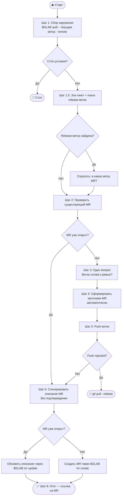

# Create Merge Request

> Во всех командах этого скилла вместо `glab` используется переменная `$GLAB`. В Шаге 1 она выбирается автоматически: `glab`, а если он не авторизован — обёртка `dp glab` (тот же синтаксис). Не захардкоживай `glab` напрямую — всегда подставляй `$GLAB`.

## Оглавление

1. [Обработка аргументов](#обработка-аргументов)
2. [Шаг 1 — Сбор окружения](#шаг-1--сбор-окружения)
3. [Шаг 1.5 — Определение целевой ветки](#шаг-15--определение-целевой-ветки)
4. [Шаг 2 — Проверь существующий MR](#шаг-2--проверь-существующий-mr)
5. [Шаг 3 — Один вопрос](#шаг-3--один-вопрос)
6. [Шаг 4 — Заголовок MR](#шаг-4--заголовок-mr)
7. [Шаг 5 — Push ветки](#шаг-5--push-ветки)
8. [Шаг 6 — Описание MR](#шаг-6--описание-mr)
9. [Шаг 7 — Создай MR](#шаг-7--создай-mr)
10. [Шаг 8 — Итог](#шаг-8--итог)

---

## Обработка аргументов

Скилл можно вызвать с текстовым аргументом (например, «обнови описание», «пересоздай MR»). Учти его явно:

- если аргумент просит **обновить описание** существующего MR — сразу переходи в Шаг 2 → Шаг 6 → обновление, минуя Шаг 3 (вопрос про готовность ветки) и Шаг 5 (push), если MR уже существует;
- если аргумент просит обновить описание, но MR для ветки **не существует** — уточни у пользователя, что делать (создать новый MR или отменить), не создавай MR молча;
- если аргумент неоднозначен или противоречит состоянию репозитория — остановись и задай уточняющий вопрос.

---

## Схема логики



---

## Шаг 1 — Сбор окружения

Выполни все команды молча, без вывода пользователю. При ошибке — останови с сообщением.

```bash
# 0. Выбери рабочий CLI: glab, а если он не авторизован — обёртку dp glab
if glab auth status >/dev/null 2>&1; then
  GLAB=glab
elif dp glab auth status >/dev/null 2>&1; then
  GLAB="dp glab"
else
  echo "Ошибка: ни glab, ни dp glab не авторизованы." && exit 1
fi

git branch --show-current                           # current_branch
git remote get-url origin                           # → host, namespace/repo
git show-ref --verify --quiet refs/remotes/origin/main && echo main \
  || git show-ref --verify --quiet refs/remotes/origin/master && echo master
                                                    # target_branch (если не найдено — остановись с ошибкой)
```

Фолбэк происходит автоматически, без вопросов пользователю. Не спрашивай «glab или dp glab?» — выбирай сам.

Если **оба** CLI не авторизованы (`exit 1`) — не останавливай workflow молча: спроси пользователя через `ask_user_question`, как продолжить (например, предложи выполнить `dp auth login` или `glab auth login`), дождись ответа и после авторизации повтори Шаг 1.

**Стоп-условия:**
- не в git-репозитории
- ни `glab`, ни `dp glab` не аутентифицированы (и пользователь не авторизовал ни один из них)
- `current_branch` совпадает с `target_branch`
- не удалось определить `target_branch`

Во всех последующих шагах используй `$GLAB` вместо `glab` (обёртка `dp glab` принимает тот же синтаксис команд).

Формат `--repo` — `<host>/<namespace>/<repo>` (из `git remote get-url origin`). И `glab`, и `dp glab` принимают его одинаково, проверка не требуется.

Если рабочая директория грязная (`git status --porcelain` не пуст) — только предупреди:
> ⚠️ Есть незакоммиченные изменения. Они не попадут в MR.

Не запрашивай подтверждение и не останавливай workflow из-за этого предупреждения.

---

## Шаг 1.5 — Определение целевой ветки

Выполни молча. Цель — выяснить, существует ли в remote release-ветка, связанная с текущим Jira-тикетом,
и если да — спросить пользователя, в какую ветку направлять MR.

```bash
# 1. Каскадный поиск Jira-тикета: имя ветки → последний коммит → все коммиты ветки
JIRA_TICKET=$(git branch --show-current | grep -oE '[A-Z]+-[0-9]+' | head -1)
[ -z "$JIRA_TICKET" ] && JIRA_TICKET=$(git log -1 --format=%s | grep -oE '[A-Z]+-[0-9]+' | head -1)
[ -z "$JIRA_TICKET" ] && JIRA_TICKET=$(git log origin/<target_branch>..HEAD --format=%s | grep -oE '[A-Z]+-[0-9]+' | head -1)
```

Каскад важен: тикет часто лежит не в имени ветки (`feat-updated-by-tests`), а в сообщении коммита.

Если Jira-тикет найден:

```bash
# 2. Обнови список remote-веток
git fetch origin --prune 2>/dev/null

# 3. Найди release-ветки вида release-<JIRA_TICKET>-*
RELEASE_BRANCHES=$(git branch -r | grep -v ' -> ' | grep -E "origin/release-${JIRA_TICKET}-" | sed 's|[[:space:]]*origin/||')
```

Если `RELEASE_BRANCHES` не пуст — задай пользователю **один вопрос** через `ask_user_question`:

```python
ask_user_question([{
    "question": "В какую ветку создавать MR?",
    "header": "Целевая ветка",
    "multiSelect": false,
    "options": [
        {
            "label": "<target_branch> (по умолчанию)",
            "description": "Основная ветка (main/master)"
        },
        {
            "label": "<release-branch-1>",
            "description": "Release-ветка для <JIRA_TICKET>"
        }
        # Добавь опцию для каждой найденной release-ветки
    ]
}])
```

Сохрани выбор как **target_branch**.

Если выбранная ветка совпадает с `current_branch` — останови workflow с ошибкой:
> ❌ Нельзя создать MR из ветки в саму себя.

Если Jira-тикет не найден или `RELEASE_BRANCHES` пуст — ничего не спрашивай,
`target_branch` остаётся как определено в Шаге 1 (main/master).

---

## Шаг 2 — Проверь существующий MR

```bash
$GLAB mr list --source-branch <current_branch> \
  --target-branch <target_branch> \
  --repo <host>/<namespace>/<repo> \
  --output json iid,title,web_url
```

Если MR **уже существует**:
- сохрани его `iid`, `title` и `web_url`;
- не задавай дополнительных вопросов;
- не создавай новый MR;
- после генерации `mr_description` обнови описание существующего MR через `$GLAB mr update`.

Если MR не найден, продолжай обычный сценарий создания нового MR.

---

## Шаг 3 — Один вопрос

Если MR для ветки ещё не существует, задай пользователю только один вопрос:

> 📋 Ветка готова к ревью? [Y/n]

- **Да (по умолчанию)** → обычный MR
- **Нет** → создать как draft

Сохрани ответ как **is_draft** (`true`, если пользователь ответил «нет»).

Если MR уже существует, этот шаг пропусти.

Во всём workflow задавай только вопросы, явно описанные в Шаге 1.5 и Шаге 3. Не добавляй уточнений от себя.

---

## Шаг 4 — Заголовок MR

Собери данные для автозаполнения:

```bash
git log origin/<target_branch>..HEAD --oneline --no-merges
```

`JIRA_TICKET` уже определён в Шаге 1.5 (каскад: ветка → последний коммит → все коммиты). Не пересобирай его заново.

На основе имени ветки и списка коммитов автоматически сформулируй заголовок:

- если `JIRA_TICKET` найден, формат: `ABCD-1234: Что делает этот MR`
- если `JIRA_TICKET` не найден, формат: `Что делает этот MR` (запомни это для Шага 8)
- до 72 символов
- на русском, технические термины как есть
- отвечает на вопрос «Что делает MR?», а не «Что изменилось в коде?»
- `feat` → «Добавить», `fix` → «Исправить», `refactor` → «Рефакторинг», `chore` → «Обновить»

Не показывай заголовок на подтверждение и не предлагай ручные корректировки.

Сохрани результат как **mr_title**.

---

## Шаг 5 — Push ветки

```bash
git rev-parse --abbrev-ref --symbolic-full-name @{u} 2>/dev/null \
  && git push origin <current_branch> \
  || git push --set-upstream origin <current_branch>
```

Если `rejected` → `Выполни git pull --rebase и повтори` → стоп.

Сообщи: `✅ Ветка <current_branch> запушена.`

---

## Шаг 6 — Описание MR

Собери diff:

```bash
git log origin/<target_branch>..HEAD --oneline --no-merges
git diff --stat origin/<target_branch>...HEAD
git diff origin/<target_branch>...HEAD
```

Если diff >500 строк — читай по ключевым файлам точечно:
```bash
git diff origin/<target_branch>...HEAD -- <path/to/file>
```

Опирайся на уже прочитанный контекст: открытые в редакторе файлы, память о тикете, обсуждения. Полный diff не нужно грузить целиком в контекст — используй его только для проверки полноты: не упущены ли файлы, не осталось ли незакрытых секций.

Проанализируй: что сделано, зачем, как реализовано, что может сломаться, как проверить.

Сгенерируй описание по шаблону. **Пустые секции опускай.**

```markdown
## 📋 Описание
<2–4 предложения: ЧТО сделано и ЗАЧЕМ. Контекст, а не пересказ кода.>

## 🔧 Тип изменений
- [ ] ✨ feat
- [ ] 🐛 fix
- [ ] ♻️ refactor
- [ ] 📦 chore
- [ ] 📝 docs
- [ ] ✅ test
- [ ] ⚡ perf

## 📝 Что изменено
- **<Модуль>**: <что и зачем>

## 💡 Технические детали
<Только нетривиальные решения. Если очевидно — опустить.>

## ⚠️ Breaking Changes
<Если нет — опустить.>

## 🗄️ Миграции / Конфигурация
<Если нет — опустить.>

## ✅ Как проверить
1. <шаг>
2. Ожидаемый результат: <что должно произойти>

## 🧪 Тесты
<Что покрывают тесты. Если нет — причина. Если неприменимо — опустить.>

## 🔗 Связанные задачи
<Ссылки на тикеты. Если нет — опустить.>
```

Не спрашивай подтверждение описания и не запускай цикл доработок.
Сохрани финальный текст как **mr_description** и сразу используй его:
- для `$GLAB mr update`, если MR уже существует;
- для `$GLAB mr create`, если MR ещё не существует.

---

## Шаг 7 — Создай или обнови MR

Если MR уже существует, обнови только его описание.

Сначала запиши `mr_description` в файл:

1. Выполни в Bash `echo "${TMPDIR:-/tmp}/mr_desc.md"` — получишь абсолютный путь temp-файла.
2. Запиши файл по этому абсолютному пути через **Write tool**.

Write tool не раскрывает переменные окружения: подставляй путь из шага 1, а не литеральный `/tmp/mr_desc.md` — в sandbox-окружениях (tclaude) корневой `/tmp` закрыт на запись, доступен только `$TMPDIR`. Heredoc (`cat > ... << EOF`) тоже не используй — в zsh-sandbox он падает.

```
<mr_description>
```

Затем:

```bash
$GLAB mr update <iid> \
  --repo "<host>/<namespace>/<repo>" \
  --description "$(cat ${TMPDIR:-/tmp}/mr_desc.md)"
```

Если MR ещё не существует, создавай его с включёнными настройками:
- `Delete source branch` (`--remove-source-branch=true`)
- `Squash commits` (`--squash-before-merge=true`)

Запиши `mr_description` в `${TMPDIR:-/tmp}/mr_desc.md` тем же способом, что и в блоке обновления выше: Bash `echo` для абсолютного пути → Write tool (не heredoc, не литеральный `/tmp`):

```
<mr_description>
```

Затем:

```bash
ARGS=(mr create
  --repo "<host>/<namespace>/<repo>"
  --source-branch "<current_branch>"
  --target-branch "<target_branch>"
  --title "<mr_title>"
  --description "$(cat ${TMPDIR:-/tmp}/mr_desc.md)"
  --remove-source-branch=true
  --squash-before-merge=true
)
[ "<is_draft>" = "true" ] && ARGS+=(--draft)

MR_OUTPUT=$($GLAB "${ARGS[@]}")
MR_URL=$(echo "$MR_OUTPUT" | grep -oE 'https://[^ ]+')
MR_ID=$(echo "$MR_URL" | grep -oE '[0-9]+$')
```

Если создаётся новый MR, после ответа пользователя на вопрос про готовность ветки не задавай больше никаких уточнений и не предлагай корректировки. Сразу создай MR.

---

## Шаг 8 — Итог

```
✅ Merge Request готов!

🔗 <MR_URL>
📋 <mr_title>
🌿 <current_branch> → <target_branch>
📝 Черновик: <Да / Нет>
```

Если `JIRA_TICKET` не был найден (Шаг 1.5), дополнительно выведи предупреждение — в проекте тикет обязателен:

> ⚠️ Jira-тикет не найден ни в имени ветки, ни в коммитах. Заголовок MR сформирован без префикса `ABCD-1234:`.

Если был обновлён существующий MR, вместо статуса создания сообщи:

```text
✅ Описание Merge Request обновлено!

🔗 <MR_URL>
📋 <existing_or_current_title>
🌿 <current_branch> → <target_branch>
```

---

## Правила написания описания

- Русский язык, технические термины (API, endpoint, middleware) — как есть
- «Зачем» важнее «что» — контекст ценнее перечисления файлов
- Группируй по логическому модулю, не по именам файлов
- Отмечай чекбоксы: `[x]`
- Не пиши «изменён файл `src/utils.ts`» — это видно в диффе
- Не оставляй секции-заглушки
